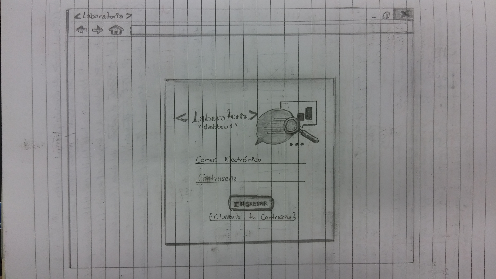
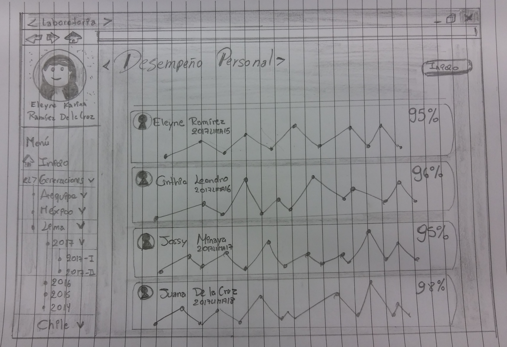

# SKETCH -dashboard de Laboratoria

Herramienta utilizada por profesores, training managers, directores y gerentes de Laboratoria para ver rápidamente qué está pasando en el salón de clases de Laboratoria. En el dashboard, los usuarios mencionados pueden ver rápidamente estadísticas y datos en tiempo real como:

1. Nro. de alumnas inscritas
2. Nro.alumnas que desertaron
3. Nro. y % de alumnas que pasan el criterio mínimo de evaluación
4. Promedio de notas por sprint
5. Promedio de notas HSE
6. Promedio de notas técnicas

## Identificando los elementos de navegación

***

***

***

